<p align="center">
  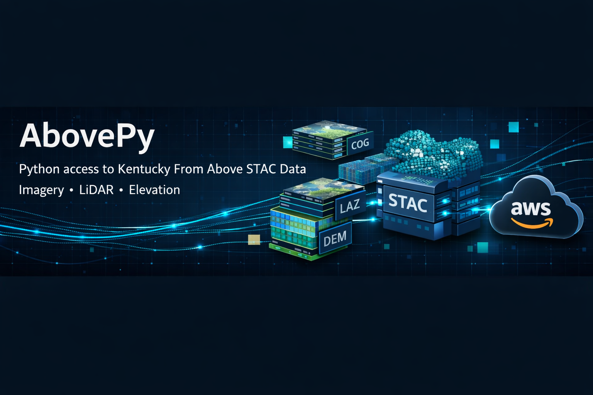
</p>

---
<p align="center">
  <a href="https://pypi.org/project/abovepy/"></a>
  <a href="https://pypi.org/project/abovepy/"></a>
  <a href="https://github.com/chrislyonsKY/AbovePy/actions/workflows/ci.yml"></a>
  <a href="https://github.com/chrislyonsKY/AbovePy/blob/main/LICENSE"></a>
  <a href="https://chrislyonsKY.github.io/AbovePy/"></a>
</p>

# abovepy

**KyFromAbove LiDAR, DEM, and orthoimagery data access for Python.**

Kentucky's [KyFromAbove](https://kyfromabove.ky.gov/) program provides statewide 2ft DEMs, 3-inch orthoimagery, and COPC LiDAR point clouds — all publicly available on S3 with a STAC API for discovery. `abovepy` gives you Pythonic access to all of it. No credentials required.

## Install

```bash
pip install abovepy
```

Optional extras:

```bash
pip install abovepy[lidar]    # COPC/LAZ point cloud support
pip install abovepy[viz]      # leafmap + matplotlib visualization
pip install abovepy[all]      # Everything
```

## Quick Start

### Search by county name

```python
import abovepy

# Find DEM tiles covering Franklin County
tiles = abovepy.search(county="Franklin", product="dem_phase3")
print(tiles)
```

### Search by bounding box

```python
tiles = abovepy.search(
    bbox=(-84.9, 38.15, -84.8, 38.25),
    product="dem_phase3"
)
```

### Download tiles

```python
paths = abovepy.download(tiles, output_dir="./data")
```

### Mosaic into a single raster

```python
vrt = abovepy.mosaic(paths, output="frankfort.vrt")
```

### Stream without downloading

```python
data, profile = abovepy.read(
    tiles.iloc[0].asset_url,
    bbox=(-84.85, 38.18, -84.82, 38.21)
)
```

### Explore available products

```python
print(abovepy.info())
#   product        display_name                format  resolution  phase  crs
#   dem_phase1     DEM Phase 1 (5ft)           COG     5ft         1      EPSG:3089
#   dem_phase2     DEM Phase 2 (2ft)           COG     2ft         2      EPSG:3089
#   dem_phase3     DEM Phase 3 (2ft)           COG     2ft         3      EPSG:3089
#   ortho_phase1   Orthoimagery Phase 1 ...    COG     6in         1      EPSG:3089
#   ...
```

## Examples

### DEM Phase Comparison

Compare 5ft Phase 1 vs 2ft Phase 3 resolution from the same tile in Frankfort:

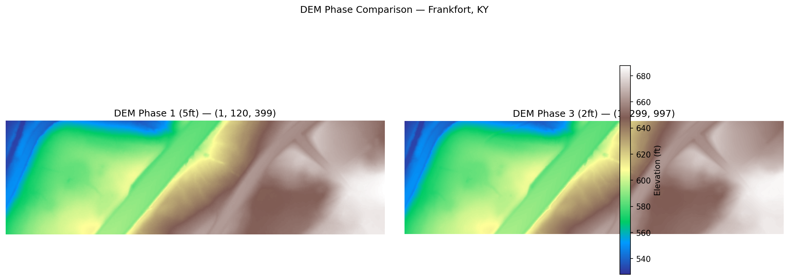

### Hillshade from Streamed DEM

Compute a hillshade directly from a cloud-hosted DEM tile — no download required:

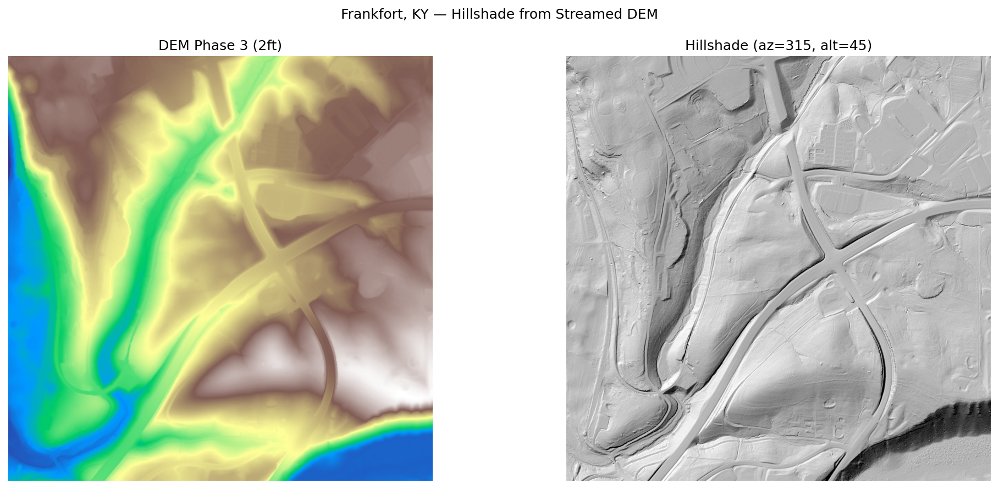

### Streamed DEM Window

Read just the pixels you need with a bounding box:

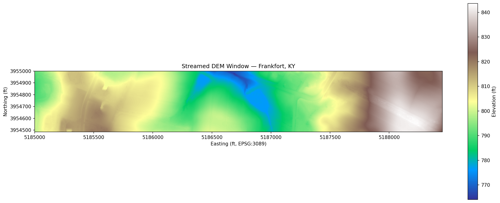

### Ortho RGB Extract

Pull 3-inch true-color imagery of the Kentucky State Capitol:

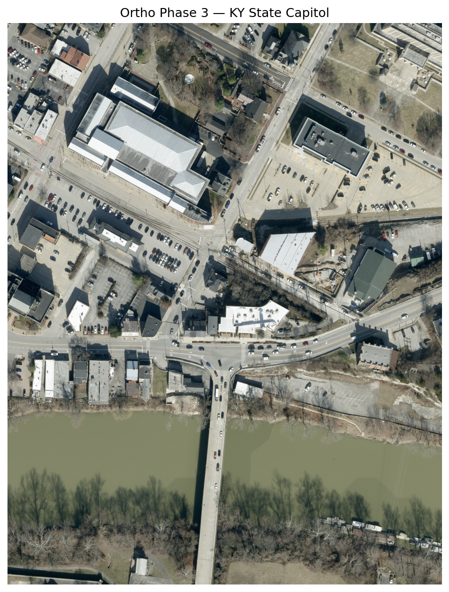

### Kentucky River REM

Relative Elevation Model showing height above the Kentucky River in Frankfort:

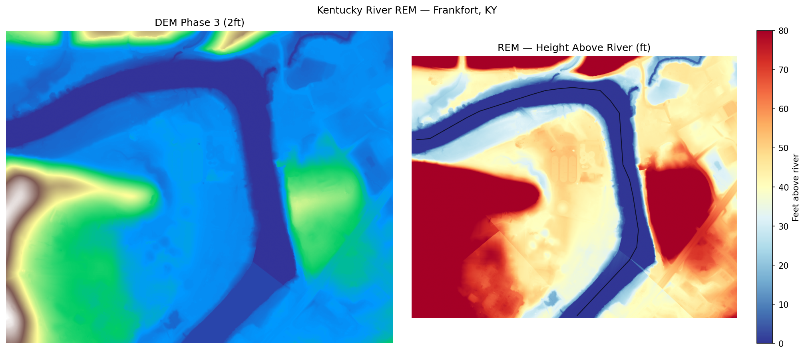

### Mine Volume Estimate

Estimate cut volume for an active mine permit in Perry County using DEM differencing:

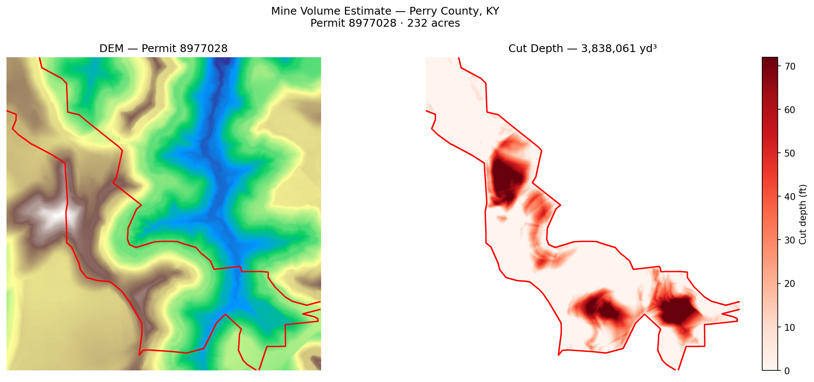

### Search Results Map

Visualize tile coverage for Franklin County:

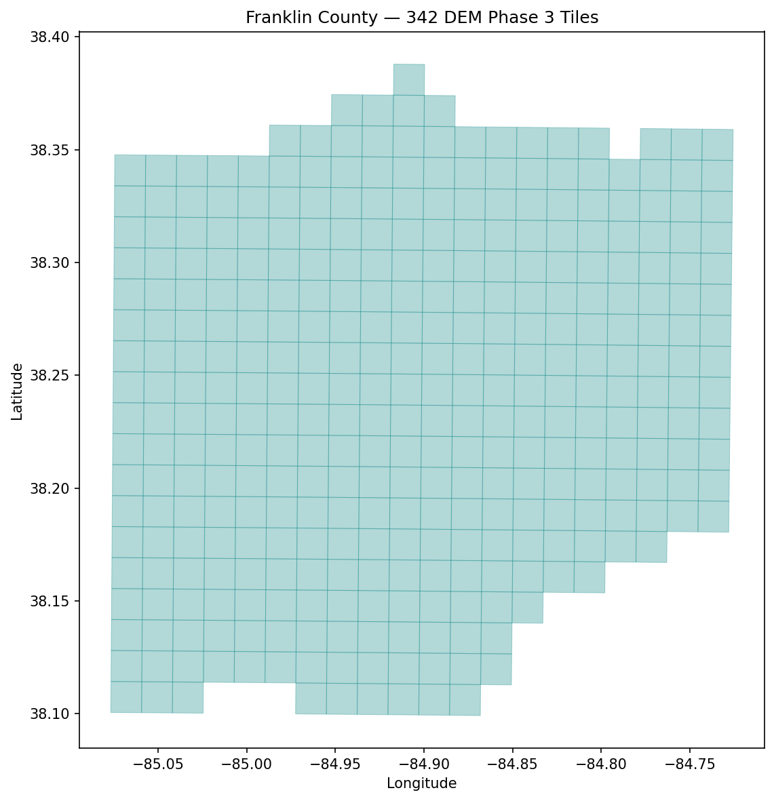

### DEM Change Detection

Compare Phase 1 vs Phase 3 DEM over a Pike County mining area to detect terrain change:

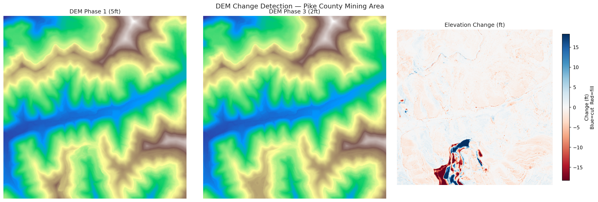

### Flood Inundation Simulation

Simulate rising water levels on a DEM — watch the Kentucky River floodplain fill:

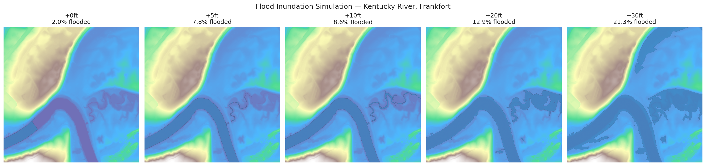

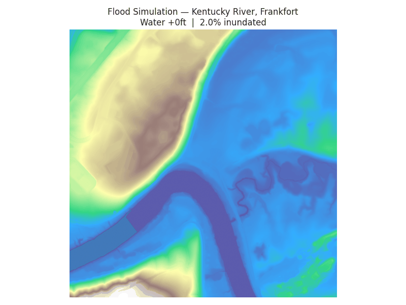

### Slope & Aspect Analysis

Compute slope and aspect from DEM for terrain analysis:

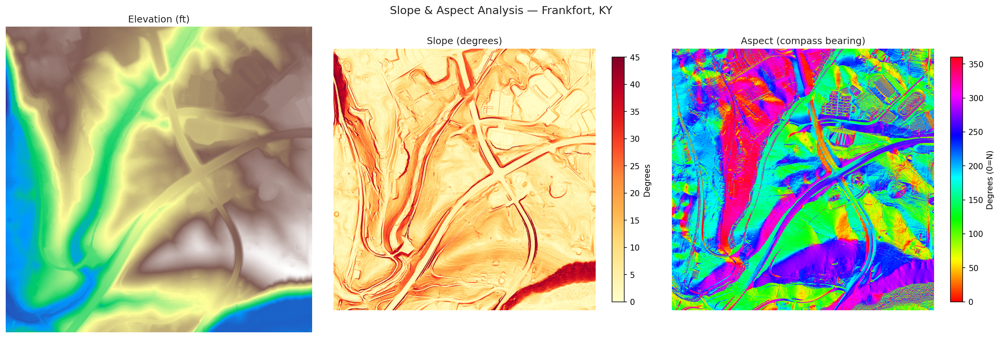

### Elevation Contours over Hillshade

Overlay 10ft/50ft contour lines on a shaded relief map:

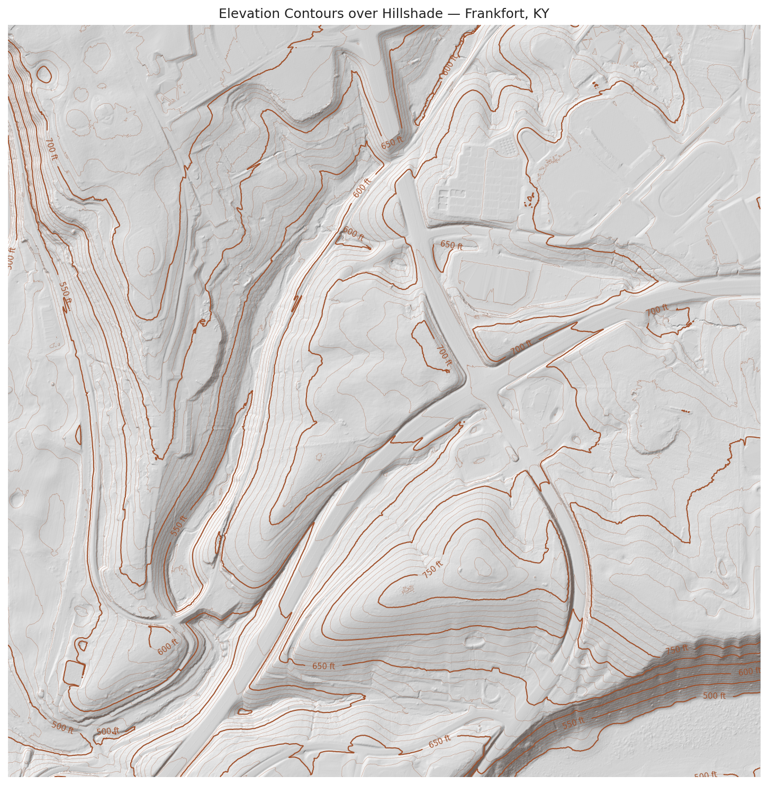

### Elevation Profile

Extract a cross-valley transect showing the Kentucky River valley profile:

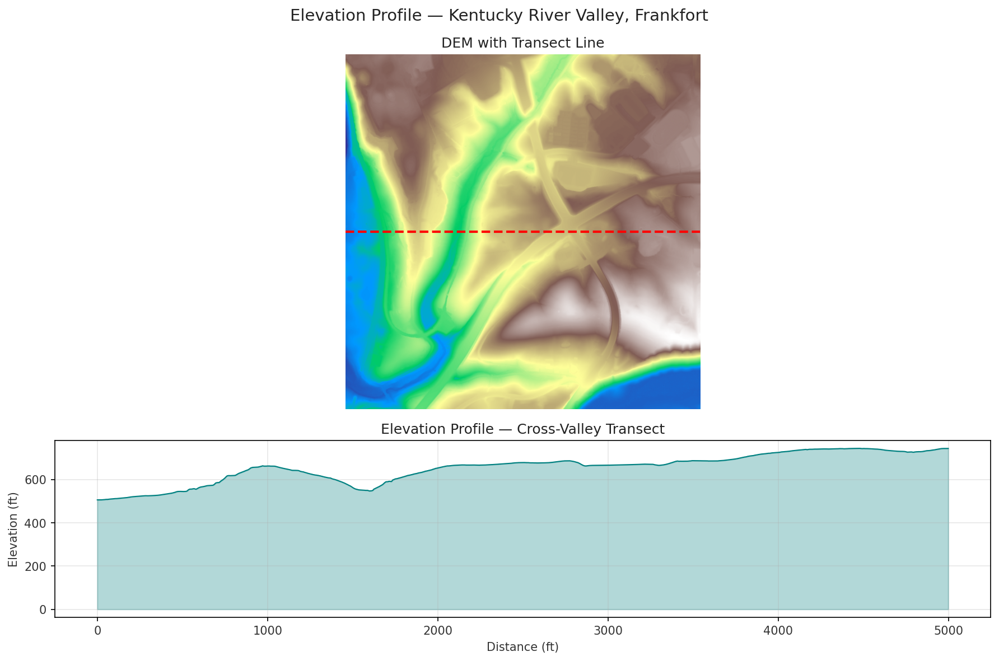

### Land Use Change

Side-by-side ortho imagery across phases showing development over time:


### Multi-County Tile Coverage

Map DEM tile coverage across five Central Kentucky counties:

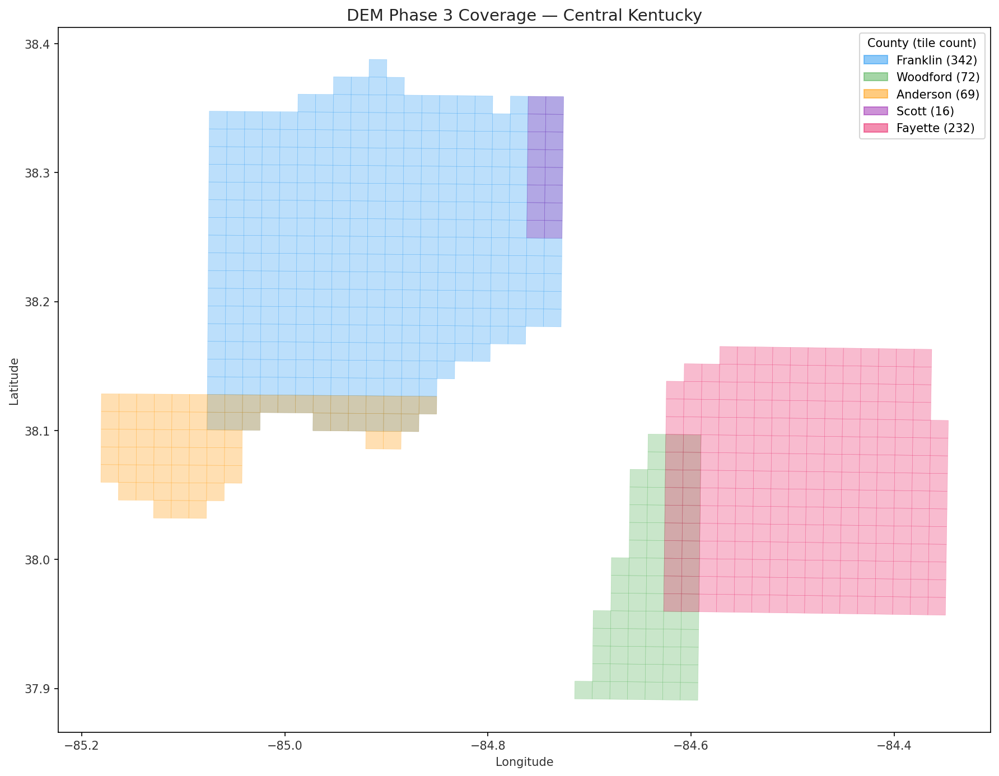

### Multi-Product Site Assessment

Combine ortho, DEM, hillshade, and slope for a single area:


### Product Gallery

One tile from each product type — DEM Phase 1/2/3 and Ortho Phase 3:

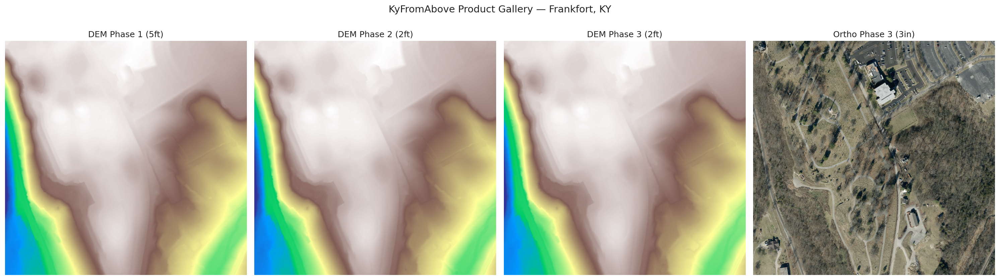

See [examples/scripts/](examples/scripts/) for the full source code behind each image.

## Available Products

| Product | Resolution | Format | Collection ID |
|---|---|---|---|
| `dem_phase1` | 5ft | COG | `dem-phase1` |
| `dem_phase2` | 2ft | COG | `dem-phase2` |
| `dem_phase3` | 2ft | COG | `dem-phase3` |
| `ortho_phase1` | 6 inch | COG | `orthos-phase1` |
| `ortho_phase2` | 6 inch | COG | `orthos-phase2` |
| `ortho_phase3` | 3 inch | COG | `orthos-phase3` |
| `laz_phase1` | Varies | LAZ | `laz-phase1` |
| `laz_phase2` | Varies | COPC | `laz-phase2` |
| `laz_phase3` | Varies | COPC | `laz-phase3` |

All data is natively in **EPSG:3089** (Kentucky Single Zone, US feet). abovepy accepts bounding boxes in EPSG:4326 by default.

## ArcGIS Pro Toolbox

An ArcGIS Pro Python Toolbox is included in `arcgis/AbovePro.pyt` with tools for:

- **Find KyFromAbove Tiles** — draw extent, pick product, see available tiles
- **Download Tiles** — download with progress tracking
- **Download and Load** — download + add to map in one step
- **DEM Hillshade** — automated DEM → hillshade workflow
- **County Download** — download by county name dropdown

See [ArcGIS Pro Toolbox Guide](https://chrislyonsKY.github.io/abovepy/tutorials/arcgis-pro/) for installation and usage.

## Web Visualization

abovepy generates TiTiler-compatible URLs for web map integration:

```python
from abovepy.titiler import cog_tile_url

url = cog_tile_url(
    cog_url=tiles.iloc[0].asset_url,
    titiler_endpoint="http://localhost:8000"
)
# Use with MapLibre GL JS or Leaflet
```

A `docker-compose.yml` for local TiTiler is in `examples/`.

## Advanced: Direct STAC Access

For power users who need the full pystac-client:

```python
client = abovepy.KyFromAboveClient()
stac_client = client.get_stac_client()

# Full pystac-client API
results = stac_client.search(
    collections=["dem-phase3"],
    bbox=(-84.9, 38.15, -84.8, 38.25),
    datetime="2022-01-01/..",
).item_collection()
```

## Related Resources

- **[kyfromabove-on-aws-examples](https://github.com/ianhorn/kyfromabove-on-aws-examples)** — Foundational examples for accessing KyFromAbove data on AWS using tile index GeoPackages and boto3. Great reference for understanding the raw S3 data structure that abovepy wraps.
- **[kyfromabove-gisconference2025-workshop](https://github.com/ianhorn/kyfromabove-gisconference2025-workshop)** — 2025 KY GIS Conference workshop covering STAC API access from Python, ArcGIS Pro, and QGIS. Includes building height estimation from COPC LiDAR, DEM change detection, and MosaicJSON workflows.
- **[KyFromAbove](https://kyfromabove.ky.gov/)** — Official program site from the Kentucky Division of Geographic Information.
- **[STAC Browser](https://kygeonet.ky.gov/stac/)** — Browse the KyFromAbove STAC catalog interactively.

## Data Source

- **STAC API:** `https://spved5ihrl.execute-api.us-west-2.amazonaws.com/`
- **S3 Bucket:** `s3://kyfromabove/` (public, us-west-2)
- **AWS Open Data Registry:** [KyFromAbove](https://registry.opendata.aws/kyfromabove/)

## License

GPL-3.0 — see [LICENSE](LICENSE).

---
